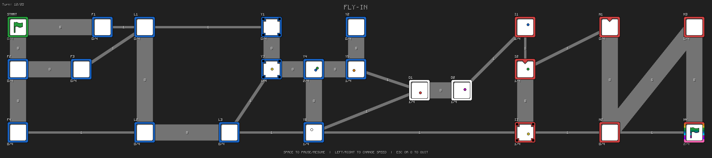
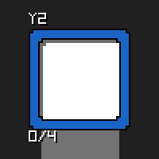
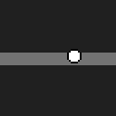
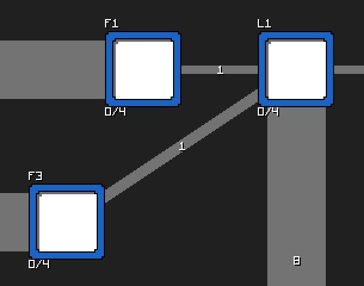
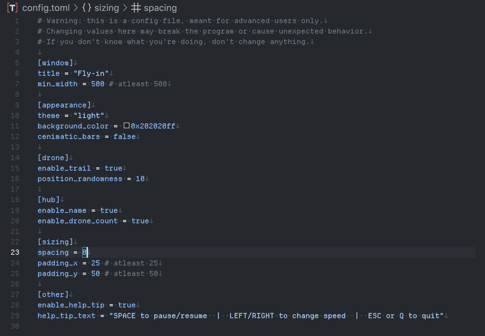
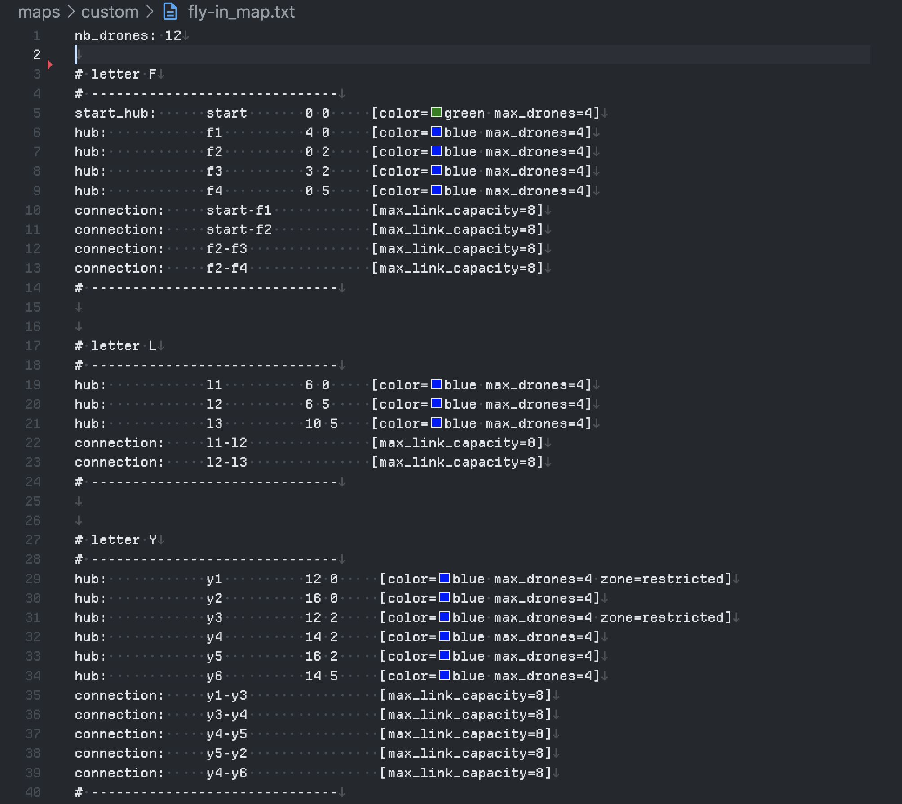

*This project has been created as part of the 42 curriculum by aait-idi*

<h1 style="
color: #FFFFFF;
font-size: 50px;
font-weight: 800">
FLY-IN
</h1>

<p1 style="
color: #aaaaaa;
">
</p1>

<h2 style="
color: #FFFFFF;
font-size: 24px;
font-weight: 800">
Description
</h2>

the project - as you read in the above section - is about navigating multiple drones through connected hubs while respecting hubs max drone capacity and connections max link capacities as efficent as possible, don't worry if you got confused already :] ill explain everything in details.

### Quick overview

    -  you provide a map file with the number of drones, hubs and connections between them.
    -  the program will read the map file and create a visual representation of it.
    -  all drones start at the start hub.
    -  the algorithm will navigate all drones to the end while respecting constaints.
    -  the program will display the drones moving through the hubs and connections in real time.
    -  the program also outputs the moves of the drones in the terminal.

---

# Resources

in this section, I will explain the main components of this project and their purpose, then I'll talk about how to run it and how to use it.

`-hub.`\

    a hub is a place where drones can land and take off, it has a maximum capacity of drones it can hold at any given time, and it can be connected to other hubs through links.`
---

`-drone.`\

    a drone is a flying vehicle that can move between hubs, it has a unique identifier and a color.

---

`-link.`\

    a link is a connection between two hubs, it has a maximum capacity of drones that can travel through it at any given time.

---

`-config.toml.`\

    config file: this is just a normal config.toml file at the root of this project, it configurations how the displayed window will look, more details below.

---

`-map_file.`\

    map file: also at the root and it's called "put_your_map_here.txt", this is where you put the number of drones and hub names, location, color and other metadata, read docs/map_file.md for syntax and more details.

---

# Instructions section containing any relevant information about compilation installation, and or execution.

# Algorithm choice and implementation strategy

# documentation for my visual representation and features and how they enhance user experience
