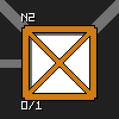
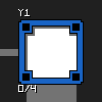
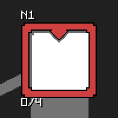

*This project has been created as part of the 42 curriculum by aait-idi.*


# Description
the project - as you read in the above section - is about navigating multiple drones through connected hubs while respecting hubs max drone capacity and connections max link capacities as efficent as possible, don't worry if you got confused already :] ill explain everything in details.


# Instructions

## Usage

### Prerequisites

All `make` commands require an active Python virtual environment. Create and activate one before running anything:

```bash
python3 -m venv venv
source venv/bin/activate
```

The Makefile will refuse to run if no virtual environment is detected.

---

### Quick start

```bash
make install
make run
```

### how the simulation goes?

you provide a map file with the number of drones, hubs and connections between them and the program will display a window with a visual representation of the hubs and connections, then it will start moving the drones from the start hub to the end hub while respecting the max capacities of hubs and connections.

the simulation is made of turns, each turn represents a unit of time in which the drones can move from one hub to another through the links, respecting the max capacities of hubs and links.

### Control

once the program stats and you see hubs and connections between them, you can press:

`space` to pause and resume the simulation

`ESC` or `Q` to quit the simulation

`Right arrow` to go to speed up the simulation

`Left arrow` to go to slow down the simulation

---

### Commands


    make install
Installs all runtime dependencies from `requirements.txt` into the active virtual environment. Skips reinstalling if dependencies are already up to date.

---
    make run
Runs the project. Will warn and exit early if dependencies haven't been installed yet — run `make install` first.

---
    make debug
Runs the project under the Python debugger (`pdb`), useful for stepping through execution.

---
    make clean
Removes all `__pycache__` and `.mypy_cache` directories generated during development.


---

### Development

    make dev
Installs development dependencies from `requirements-dev.txt` (includes linting tools).

---
    make lint
Runs both `flake8` (style) and `mypy` (type checking) across the project.

---
    make lint-strict
Same as `make lint` but runs mypy in strict mode.

---
You can also run each linter individually:

    make lint-flake8
    make lint-mypy
    make lint-mypy-strict


*Linting commands require `flake8` and `mypy` to be installed. Run `make dev` if they are missing.*


### config files and map

#### config.toml
\
config file: this is just a normal config.toml file at the root of this project, it configurations how the displayed window will look, more details below.

config file syntax:

[window]

    title = # window title (string)
    min_width = # window minimum width (intiger)

[appearance]

    theme = # theme name, can be "dark" or "light", you can add custom themes and paste in assets/
    background_color = # background color in hex format (#262A2F)
    cenimatic_bars = # wether to have black bars on top and bottom of the window or not (true or false)

[drone]

    enable_trail = # wether to have a trail behind the drones or not (true or false)
    position_randomness = # how much randomness to add to the drone position in pixels, 0 means no randomness. (intiger)

[hub]

    enable_name = # wether to display the hub name or not (true or false)
    enable_drone_count = # wether to display the number of drones on the hub or not (true or false)

[sizing]

    spacing = # spacing between hubs in pixels (intiger)
    padding_x = # padding on the left and right of the window in pixels (intiger)
    padding_y = # padding on the top and bottom of the window in pixels (intiger)

[other]

    enable_help_tip = # wether to display the help tip or not (true or false)
    help_tip_text = # text to display in the help tip (string)


---
#### map_file
\
map file is also at the root and it's called "put_your_map_here.txt", this is where you put the number of drones and hub names, location, color and other metadata, read docs/map_file.md for syntax and more details.

# visual representation
in this section, I will explain the main components of this project and their purpose, and their visual representation.

## components
#### hub
\
a hub is a place where drones can land and take off, it has a maximum capacity of drones it can hold at any given turn (time), and it can be connected to other hubs through links, each hub can have a metadata spicifying which zone type it is, the one above is a **Normal** hub.

---
#### hub_blocked
\
drones wont be able to land on this hub at all, it's blocked area.

---
#### hub_restricted
\
same as Normal hub but sensitive or dangerous, it costs 2 turns to go to.

---
#### hub_priority
\
same as Normal hub but will be prioritized when drones are moving, it costs 1 turn to go to.


---
#### drone
\
a drone is a flying vehicle that can move between hubs, it has a unique identifier and a color (not necessarily unique).

---
#### link
\
a link is a connection between two hubs, it has a maximum capacity of drones that can travel through it at any given time.


# Algorithm choice and implementation strategy

I used a modified dijkstra algorithm, cuz it's the most efficient when it comes to finding shortest paths in graphs.

**My modification is:**\
once a drone finds the shortest path, i update a dictionary that keeps track of what each drone reserved for each hub and each link, this i way, i get to find the shortest path overall and prevent drones from crashing into each other.

# Resources

| Resource                                                                     | Description                                                                              |
| ---------------------------------------------------------------------------- | ---------------------------------------------------------------------------------------- |
| [3d graph theory](https://d3gt.com/index.html)                               | A resource for understanding graph theory and its applications in 3D space.              |
| [Dijkstra's Algorithm](https://en.wikipedia.org/wiki/Dijkstra%27s_algorithm) | Wikipedia page explaining Dijkstra's algorithm for finding the shortest paths in graphs. |
| Ai                                                                           | was used to write readme and docs/map_file.md, and repetitive code                       |
