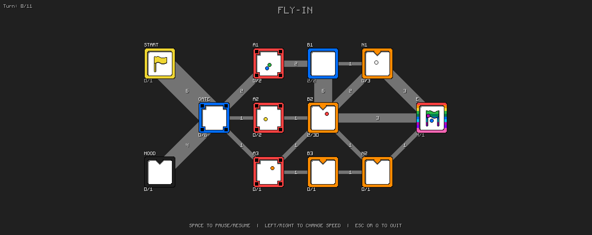

*This project has been created as part of the 42 curriculum by aait-idi.*

# Fly-in



## Description

Fly-in routes multiple drones from a starting hub to a destination through an
undirected network. It plans simultaneous movements while respecting hub and
connection capacities, blocked zones, and the extra travel time needed to enter
restricted zones. The goal is to deliver every drone in as few turns as possible.

The program prints a movement schedule to the terminal and displays it in an
interactive MLX42 window.

## Instructions

### Requirements and setup

Use Python 3.10 or later and run commands from the project root. The graphical
interface requires a working desktop display and an MLX42 shared library
compatible with your system. Linux and macOS library files are included as
`libmlx42.so` and `libmlx42.dylib`; the loader also supports Windows if a
compatible `libmlx42.dll` is supplied.

Create and activate a virtual environment, then install the Python dependencies:

```bash
python3 -m venv venv
source venv/bin/activate
make install
```

Runtime dependencies are Pydantic, Pillow, and tomli. The Makefile uses Bash;
these setup commands are intended for Linux/macOS shells.

### Run a simulation

Edit `put_your_map_here.txt` with your map, then run:

```bash
make run
```

The input filename is fixed; the program does not accept a map path as a command
line argument. It reads display settings from `config.toml`. Paths to the map,
configuration, fonts, and themes are relative to the project root.

The program computes and prints the complete schedule, then opens playback in a
paused state. Press **Space** to start. At the end of playback, the display resets
to the initial state and pauses so you can replay the simulation.

### Controls

| Key | Action |
| --- | --- |
| Space | Start, pause, or resume playback |
| Right arrow | Increase playback speed |
| Left arrow | Decrease playback speed |
| T | Toggle drone trails |
| R | Reset the simulation and pause |
| Esc or Q | Close the window |
| Ctrl+C | Exit during setup/planning or close active playback |

### Makefile commands

| Command | Purpose |
| --- | --- |
| `make` / `make all` / `make fly-in` | Prepare the project by installing runtime dependencies as needed |
| `make install` | Install runtime dependencies when the environment's stamp is missing or outdated |
| `make re-install` | Force runtime dependency installation |
| `make run` | Install runtime dependencies as needed, then run the application |
| `make debug` | Run the entry point with Python's `pdb` debugger |
| `make clean` | Remove `__pycache__` and `.mypy_cache` directories |
| `make fclean` | Also remove the active environment's dependency stamp |
| `make re` | Run `fclean`, then prepare the project again with `all` |
| `make dev` | Install runtime dependencies and development tools, including Flake8 and mypy |
| `make lint` | Run Flake8 and mypy with the subject's required flags |
| `make lint-strict` | Run Flake8 and mypy with `--strict` |

`all`, `fly-in`, `re`, `install`, `re-install`, `run`, `debug`, and `dev` require an active virtual
environment. Lint commands require Python 3.10+ with the runtime dependencies,
Flake8, and mypy installed in the same Python environment.
Individual targets are `lint-flake8`, `lint-mypy`, and `lint-mypy-strict`.

For development, activate your virtual environment and run `make dev` before
`make lint` or `make lint-strict`. Mypy checks compatibility with Python 3.10.
If macOS selects an older Python, create a new environment with an installed
Python 3.10+ interpreter, for example:

```bash
python3.10 -m venv .venv
source .venv/bin/activate
make dev
make lint
```

The installation stamp is stored at `$VIRTUAL_ENV/.fly-in-deps-installed`.
Run `make install` again after creating or switching environments.

Run the application with `make run` or `python3 fly-in.py` inside the active
environment. Python sources run directly without compilation. Repeated `make`
calls skip dependency installation when the stamp is current. The bundled MLX42
libraries are used precompiled.

### Map format and example

The first nonblank, noncomment line sets a positive drone count. Define exactly
one start hub and one end hub. Define hubs before connections that reference
them. Comments begin with `#`. See [Map File Syntax](docs/map_file.md) for the
full format, metadata, and supported display colors.

For this example, put the following in `put_your_map_here.txt`:

```text
nb_drones: 2
start_hub: start 0 0 [color=green]
hub: middle 1 0
end_hub: goal 2 0 [color=yellow]
connection: start-middle
connection: middle-goal
```

Expected terminal output:

```text
D1-middle
D1-goal D2-middle
D2-goal
```

Each line represents one turn. A drone that waits is omitted from that line.
For travel toward a restricted zone, a drone first appears on the connection
(e.g. `D1-start-middle`), then reaches the hub on the next turn. Delivered drones
stop appearing in the output.

Unsupported single-word color names produce a warning on stderr and use the
default dark gray color; they do not stop the simulation. Hub names may contain
punctuation such as `roof.1` or `gate@east`, but cannot contain whitespace or
dashes. `#` starts a comment. The current parser requires unique hub coordinates.
Metadata fields must be separated by whitespace, and each key may appear only
once per block.

### Display configuration

Edit the existing sections in [config.toml](config.toml). Colors are packed RGBA
integers such as `0xFFFFFFFF` (opaque white), not strings beginning with `#`.

| Section | Settings |
| --- | --- |
| `window` | `title`, `min_width` |
| `appearance` | `theme` (`light` or `dark`), `background_color`, `cenimatic_bars` |
| `drone` | `enable_trail`, `trail_opacity` (0–1), `position_randomness` (0–32 pixels) |
| `hub` | `enable_name`, `name_color`, `enable_drone_count` |
| `connection` | `color`, `text_color`, `stroke_color` |
| `sizing` | `spacing`, `padding_x` (at least 25), `padding_y` (at least 50) |
| `other` | `enable_help_tip`, `help_tip_text` |

Keep the spelling `cenimatic_bars`: this is the key used by the implementation.
Custom themes go in `assets/themes/<theme>/` and must supply the same seven PNG
sprites as the bundled themes. Font sheets are stored in `assets/font/`.

## Visual representation

Hub sprites distinguish normal, blocked, restricted, priority, start, and end
zones. Hub names help relate the display to the map, and occupancy labels show
where drones accumulate. Start and end hubs are exempt from occupancy limits;
their displayed capacity is still the configured metadata value.

Normal and priority zones take one turn to enter. Restricted zones take two
turns, with the drone shown on the connection during transit. Blocked zones
cannot be entered. Priority zones are preferred when arrival times are equal.

Connections display their capacities. Colored drones, optional trails, a turn
counter, and playback controls make routes and bottlenecks easier to follow.
Drones disappear when delivered. Long hub names are shortened in the display.

## Algorithm choice and implementation strategy

The `Graph` class builds nodes and bidirectional edges from the parsed map. It
plans drones one at a time using a Dijkstra-style search over `(hub, turn)`
states. A priority queue explores earlier arrival times first, then favors
routes with more priority-zone visits when arrival times tie.

A transition to a normal or priority hub costs one turn. A transition to a
restricted hub costs two turns and records an intermediate connection position.
Blocked neighbors are skipped. Waiting is considered while existing
reservations can affect movement; revisiting a hub already in the route is
otherwise disallowed.

After planning a drone, the algorithm reserves its hub occupancy and connection
usage in a dictionary indexed by turn. Later drones use the remaining capacities
to choose routes or wait. A drone departing a hub frees that space for the same
turn. Arriving from a restricted connection frees the connection for another
drone to enter it that turn. Start waiting and end delivery are exempt from hub
capacity limits.

Routes are stored for output and animation. A fresh search is performed for each
drone; routes are not recomputed during playback. Search cost and memory usage
grow with the number of reachable hub/turn states, and queued candidates carry
copies of their partial paths. This sequential reservation strategy is practical
but does not guarantee a globally minimum completion time for every graph.

## Resources

- [3D Graph Theory](https://d3gt.com/index.html): interactive graph theory material.
- [Dijkstra's algorithm](https://en.wikipedia.org/wiki/Dijkstra%27s_algorithm):
  background on priority-queue shortest-path searches.

AI assisted with the README, map-format documentation, repetitive code,
Google-style docstrings, a subject-compliance review, and the unsupported-color
warning/fallback change. Temporary checks were used to verify parser behavior,
routing constraints, and the documented example.
